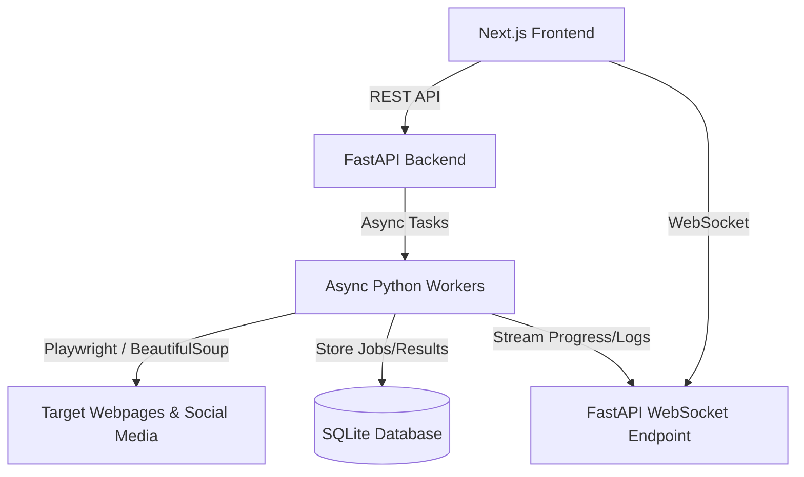

# OmniScrape Suite (Scrappers All-in-One)

[](https://opensource.org/licenses/MIT)
[](https://fastapi.tiangolo.com)
[](https://nextjs.org)
[](https://playwright.dev/python/)

A multi-platform business data scraper and real-time dashboard. Features a Next.js frontend and a FastAPI backend with WebSockets to run and monitor scrapers for websites, Google Maps, Facebook, Instagram, and LinkedIn, supporting structured data exports to Excel, Word, and PDF.

## 🚀 Features

- **Real-Time Job Monitoring**: Watch logs and progress percentages live over WebSockets.
- **Master Orchestrator**: Input a website URL, detect its associated social platforms, and run sub-scrapers automatically.
- **6 Built-in Scraper Modules**:
  1. **General Orchestrator**: Aggregates website, social links, and runs platform scrapers in parallel.
  2. **Website Crawler**: Recursively extracts metadata, headings, body text, emails, phones, schema.org markup, and documents.
  3. **Google Maps**: Gathers business profiles, ratings, review feeds (with sorting/pagination), and owner replies.
  4. **Instagram**: Public profile metrics (followers, posts) and post details (captions, tags).
  5. **LinkedIn**: Collects company profile description, job openings, and public posts.
  6. **Facebook**: Public page info, events, reviews, and post contents.
- **Rich Document Exports**: Support for Excel sheets, PDF summaries, and Microsoft Word formats.

## 🛠️ Architecture

The project splits into a Next.js web application and a FastAPI python service:



## 📦 Directory Structure

```
├── backend/
│   ├── app/
│   │   ├── models/        # Database models
│   │   ├── routers/       # API route handlers (scrape, jobs, results, exports, logs)
│   │   ├── schemas/       # Pydantic validation schemas
│   │   ├── scrapers/      # Playwright Scraper modules (base, general, website, google_maps, facebook, etc.)
│   │   ├── main.py        # FastAPI entrypoint
│   │   └── database.py    # SQLite connections
│   ├── Dockerfile
│   └── requirements.txt
├── frontend/
│   ├── src/
│   │   ├── app/           # App router pages (dashboard layout, custom scraper views)
│   │   ├── components/    # Reusable UI widgets & job tracker panels
│   │   └── hooks/         # React hooks (WebSocket feed client)
│   └── package.json
└── docker-compose.yml
```

## 🚦 Getting Started

### Prerequisites

- **Python 3.10+**
- **Node.js 18+**
- **Google Chrome / Playwright Webkit installed**

### Backend Setup

1. Navigate to the backend folder:
   ```bash
   cd backend
   ```
2. Install Python dependencies:
   ```bash
   pip install -r requirements.txt
   ```
3. Install Playwright browser binaries:
   ```bash
   playwright install chromium
   ```
4. Copy the environment template and edit parameters if needed:
   ```bash
   cp .env.example .env
   ```
5. Run the development server:
   ```bash
   python -m uvicorn app.main:app --host 127.0.0.1 --port 8000
   ```
   The API documentation will be available at `http://127.0.0.1:8000/api/docs`.

### Frontend Setup

1. Navigate to the frontend folder:
   ```bash
   cd frontend
   ```
2. Install Node dependencies:
   ```bash
   npm install
   ```
3. Run the development server:
   ```bash
   npm run dev
   ```
   Open `http://localhost:3000` to interact with the dashboard.

## 📝 License

Distributed under the MIT License. See `LICENSE` for more information.
